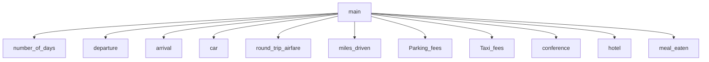

# Personal Income
Wilson, Kade, Abby, Zac

## <chapter6Team> Description
It gets the amount of expenses for a trip

### Personal Income Flowchart

#### Function Diagrams

| `Main`    |               |          Kade         |
| ------------------ | ------------- | ------------ |
| `integar`    | no agruments         |              |
| `time:integer`     | calculates the total travel expenses for a businessperson on a trip   | outputs the total travel expenses for a businessperson on a trip             |
| `name:string`      |  | returns 0 |
***
| `number_of_days`    |                                       |           Zac            |
| ------------------ | -------------                     | ------------ |
| `accepts no arguments`    | takes input from the user for number of days  |              |
|      | calculates nothing  | outputs a new line             |
| `int ` |     | takes input for number of days | returns days |
***
| `departure`    |               |     Zac   |
| ------------------ | ------------- | ------------ |
| `accepts no arguments`    | takes input from the user for number when they leave the house  |              |
|     | calculates nothing  | outputs a new line             |
| `string`      | takes input for leaves the house | returns departure |
***
| `arrival`    |               |     Zac   |
| ------------------ | ------------- | ------------ |
| `accepts no arguments`    | takes input from the user for what time the user get back home |              |
|    | calculates nothing  | outputs a new line             |
| `string`      | takes input for when the user gets back home | returns arrival |
***
| `car`    |               |     Zac   |
| ------------------ | ------------- | ------------ |
| `accepts no arguments`    | takes input from the user for the amount the user paid in car rentals |              |
|     | calculates nothing  | outputs a new line             |
| `int`      | takes input for the price of total car rentals | returns days |
***
| `round_trip_airfare`    |               |     Zac   |
| ------------------ | ------------- | ------------ |
| `accepts no arguments`    | takes input from the user for the price for airfare  |              |
|     | calculates nothing  | outputs a new line             |
| `float`      | takes input for round trip airfare | returns days |
***
| `miles_driven`    |               |    Wilson    |
| ------------------ | ------------- | ------------ |
| `accepts no arguments`    | takes input from the user for the amount of miles  |              |
|     | calculates miles*.27 to get total   | outputs a total             |
| `float`      | takes input for number of miles | returns milesprice |
***
| `Parking_fees`    |               |    Wilson    |
| ------------------ | ------------- | ------------ |
| `needs numberofdays`    | takes input from the user for parking fees  |              |
|     | calculates if the user input is more than 6 then the person must pay   | outputs a if the user has more than 6            |
| `float`      | takes input for parking fees | returns parkingfee |
***
| `Taxi_fees`    |               |    abby   |
| ------------------ | ------------- | ------------ |
| `needs number of days`    | takes input for the amount of taxi fees |              |
|     | calculates the amount per day and if user went over and output what user must pay  | output what user must pay  |
| `float`      | takes input for price| returns taxi_fees |
***
| `conference`    |               |    abby   |
| ------------------ | ------------- | ------------ |
| `accepts no arguments`    | takes input for conference fees |              |
|    | caluclates nothing  | output what user must pay  |
| `float`      | takes input for number of miles | returns fees |
***
| `hotel`    |               |    abby   |
| ------------------ | ------------- | ------------ |
| `needs number of days`    | takes input for the amount of for lodging|              |
|    | calculates the overspending amount above 90 | output what user must pay  |
| `float`      | takes input for price per night | returns hotel |
***
| `meal_eaten`    |               |    Wilson    |
| ------------------ | ------------- | ------------ |
| `accepts time of departure and time of arrival and number of days`    | takes input for each day 3 times using loop |              |
|    | calculates if the total price   | outputs a if the user has more than 6            |
| `float`      | takes input each day 3 times | returns foodprice|
***
