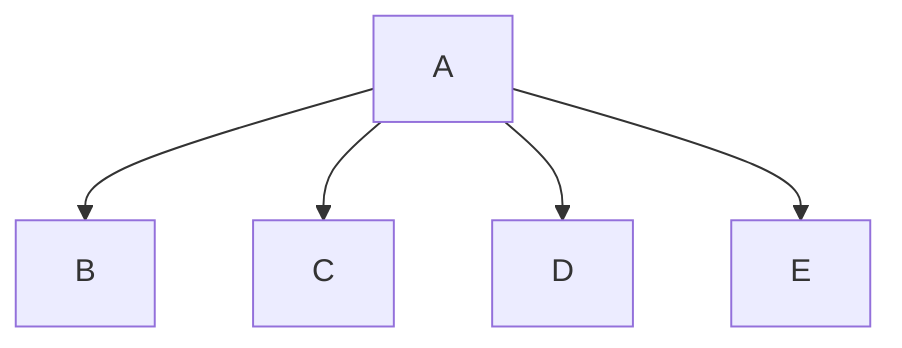

# Program Name
Wilson, Kade, Abby, Zach

## <program_name> Description
Here is where you describe what the program does

### <program_name> Flowchart

#### Function Diagrams

| `Main`    |               |  Kade     |
| ------------------ | ------------- | ------------ |
| `argument:type`    | takes input from the user for ____  |              |
| `time:integer`     | calculates ______  | outputs ____             |
| `name:string`      | takes input for name ___ | returns total |
***
| `function name2`    |               |     author   |
| ------------------ | ------------- | ------------ |
| `argument:type`    | takes input from the user for ____  |              |
| `time:integer`     | calculates ______  | outputs ____             |
| `name:string`      | takes input for name ___ | returns total |
***
